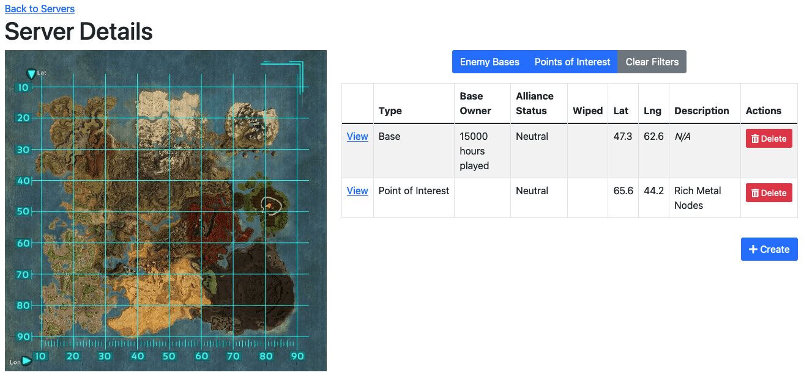
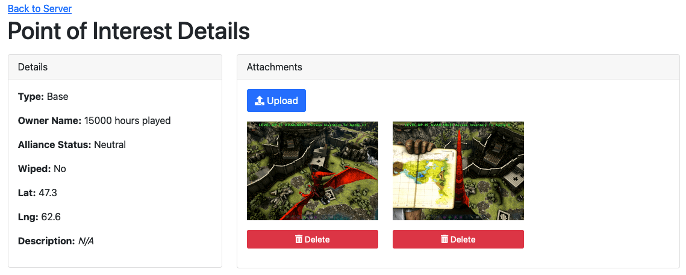

# ArkBaseTracker (Front End)

This is an application designed to help your tribe keep track of important points of interest or base locations in the video game `ARK: Survival Evolved`. Useful for both PVP and PVE game modes, this application provides a centralized database your tribe can use to document:

- Where that Giga or Alpha Rex is that you've trying to been find for days
- Enemy bases to raid
- Useful dino and resource spawns
- Explorer note locations
- And more!

This project is a front-end only and is designed to be used in conjunction with [https://github.com/johnthegreat/ArkBaseTracker](https://github.com/johnthegreat/ArkBaseTracker).

Built with React and Bootstrap 5.

## Screenshots

## Features

- Multi-cluster support
- Multi-server support per cluster
- Multi-base support per server
- Upload screenshots to points of interest
- Official and unofficial clusters and servers supported alike
- Some unofficial and all official DLC maps supported including the latest, Lost Island

## Instructions

Requires Node.js installed to build. Once built, generates static HTML/JS files.

1. Clone or download the repository.
2. Run `npm install` (or `npm i` for short).
3. Copy `.env.example` to `.env`.
4. In `.env`, populate `REACT_APP_API_BASE_URL` with the URL to the backend application.
5. Run `npm run build` for a production build. A `build/` folder will be generated with the static assets. 
   - Alternatively, run `npm run start` to start a server for development purposes.

## License

Copyright &copy; 2021 John Nahlen. See `LICENSE.md`.

Licensing Note: I believe the map images in `public/maps` were found at the [Official ARK Wiki](https://ark.fandom.com/wiki/ARK_Survival_Evolved_Wiki) and are thus licensed [CC BY-NC-SA 3.0](https://creativecommons.org/licenses/by-nc-sa/3.0/) and are property of their respective owners (unknown).
I used [TinyPNG.com](https://tinypng.com/) to process the images to reduce their file sizes.